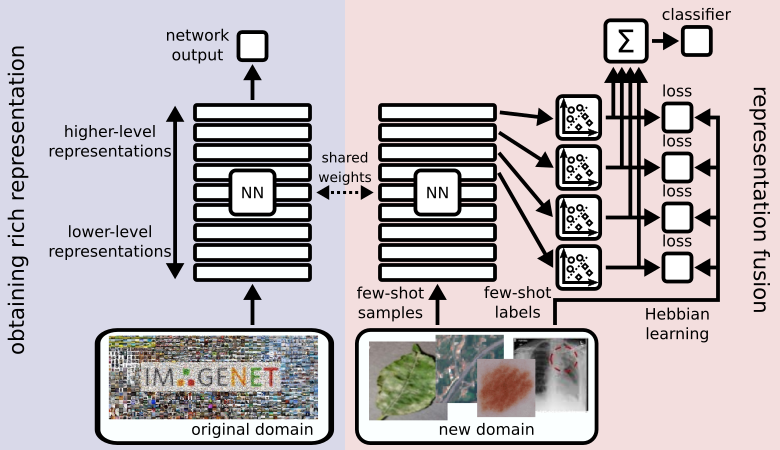

<link rel="stylesheet" href="assets/css/accordion.css">

This blog post explains the few-shot learning method **CHEF** introduced in the paper [Cross-Domain Few-Shot Learning by Representation Fusion](https://arxiv.org/abs/2010.06498).  

  

# Cross-domain few-shot learning

Few-shot learning aims at learning from few examples, often by
using already acquired knowledge and, therefore,
enabling models to quickly adapt to new data.
The reason for observing new data is a domain shift, that is,
a change of the input-target distribution. 
While most few-shot learning methods can cope with a small 
domain shift, larger changes in the data distribution, however, are
still challenging. **CHEF** (**C**ross-domain **H**ebbian **E**nsemble 
**F**ew-shot learning) is a **few-shot learning method, that is 
specifically designed to overcome the problems arising from domain 
shifts**. 

## Domain shifts

A domain shift occurs when the distribution of input and/or target 
variables changes considerably. There can be several reasons for that. 
For instance, a product that is adapted to a new environment like a 
self-driving car that is deployed to new city. Often, it is very costly 
and sometimes even impossible to acquire enough labeled data to re-train 
the models for the new domain. In these cases it is desireable to have 
models that cope with the domain shift even when only very little data is 
available. As the domain shifts become large, this problem becomes very 
challenging. 

We consider domain shifts of different sizes. 
[*mini*Imagenet](https://arxiv.org/abs/1606.04080) is a standard 
few-shot data set that has a **small domain shift** between training and test set. 
While the sets of classes in these two data sets are disjoint, the classes 
in these sets might be very similar, like, e.g. different dog breeds. Further, 
we consider [*tiered*Imagenet](https://arxiv.org/abs/1803.00676), 
another Imagenet-based few-shot data set, 
where the split was made such that the sets of classes in training set and 
test set are less similar. However, also the domain shift in *tiered*Imagenet 
is rather small. 

The main purpose of our work, however, is to tackle **large domain shifts**. 
For that, training on Imagenet or a subset of Imagenet is considered. 
The resulting models are evaluated on the 
[cross-domain few-shot learning benchmark](https://arxiv.org/abs/1912.07200) 
that consists of specific datasets like images of plant diseases,
from satellites, of skin lesions, 
or X-rays. To also explore domains other than images, we investigate 
**domain shifts in drug design tasks**. Such experiments can help to utilize 
models for designing drugs for new diseases like COVID19. 

For image domains, we use the 
[Fréchet Inception Distance](https://arxiv.org/abs/1706.08500) (FID)
to measure the size of the domain shift which has proven reliable for 
assessing performance of 
[Generative Adversarial Networks](https://arxiv.org/abs/1406.2661). 
The following table lists the FID between the *mini*Imagenet domain 
and the four new domains. 

According to the FID, the satellite images are even closer to the original 
domain than the plant disease images. This can be explained by the fact 
that the satellite images have a higher variety of shapes and colors than 
the plant disease dataset. 

# Representation fusion

Deep neural networks consist of a hierarchical structure of layers. 
These layers maintain different representations of the input data. 
These representations differ mainly in their level of abstraction. 
Let us consider the example of convolutional neural networks and how 
they process images. Layers close to the input layer capture low-level
structures like edges or small textures. Layers close to the output 
layer represent high-level structures like the presence of more complex 
shapes or entire objects. 

As the domain shift gets large the high-level concepts will eventually 
stop working. A network which was trained to classify animals will 
have high-level features to recognize things like legs, eyes, fur textures, 
etc. If this network is now used to classify buildings it will barely 
encounter these kinds of objects anymore. This, however, does not mean 
that the network layers do not bare any useful information about the 
new task. Only to get to this information we might have to dig deeper into 
the network structure. 

CHEF combines features from layers of different levels of 
abstraction. So even when the high-level representations crumble features of 
lower layers can take over and still allow for a decent prediction result. 
We call this concept **representation fusion**. It allows a flexible 
choice of the right level of abstraction for the few-shot task at hand
depending on the size of its domain shift. 
We implement representation fusion using an ensemble of Hebbian learners 
operating on distinct representation levels in parallel. The results of 
these learners are then combined into a single prediction. 

## A simple Hebbian learning rule

To obtain predictions for the individual levels of abstraction we could 
in principle use any learning algorithm. We choose a Hebbian 
learning rule because it is simple and fast while being robust and reliable. 
However, the choice of this algorithm can change with the problem setting. 

We consider an $$N$$-shot $$K$$-way setting, which means that we are given 
a small dataset with $$K$$ different classes. Each of these classes is 
represented by $$N$$ samples. Hence, our few-shot dataset has the form 
$$\{(\mathbf{x}_i, \mathbf{y}_i)\}_{i=1}^{NK}$$, where $$\mathbf{x}_i$$
are the inputs and $$\mathbf{y}_i$$ are the labels indicating class membership.

Let $$\mathbf{z}_i \in \mathbb{R}^D$$ be a feature 
vector obtained from activating the backbone network with a sample 
$$\mathbf{x}_i$$ up to a certain layer, where $$D$$ is the number of 
units in that layer. 
We combine the $$NK$$ feature 
vectors into a matrix $$\mathbf{Z} \in \mathbb{R}^{NK \times D}$$ and 
initialize a weight matrix 
$$\mathbf{W} = \mathbf{0} \in \mathbb{R}^{K \times D}$$. 
We apply the Hebbian learning rule 

$$\mathbf{W} \gets \mathbf{W} - \alpha \mathbf{V}^\top \mathbf{Z}$$

for a given number of steps, where $$\alpha$$ is a Hebbian learning rate and 
$$\mathbf{V} \in \mathbb{R}^{NK \times K}$$
is the matrix of postsynaptic responses $$\mathbf{v}_i$$. 
Given a loss function $$\mathcal{L}(\cdot, \cdot)$$, we choose the 
postsynaptic response 

$$\mathbf{v}_i = \nabla_{\mathbf{u}} 
\mathcal{L}(\mathbf{y}_i, \mathbf{u}) 
|_{\mathbf{u} = \mathbf{W}\mathbf{z}_i}.$$ 

Note, that if we want to use the cross-entropy loss, then we have to define 

$$\mathcal{L}(\mathbf{y}, \mathbf{u}) = - \mathbf{y}^\top \log 
\operatorname{softmax} \mathbf{u}, $$

i.e. we have to convert $$\mathbf{u}$$ to a discrete probability distribution 
first. 

## Combining multiple Hebbian learners

As stated above, we apply the Hebbian learning rule to different layers of 
a deep neural network in parallel, and thus perform learning on different 
levels of abstraction. Each of these learners yields a (possibly different) 
prediction for the current few-shot task. We implement 
**representation fusion** by summing over these predictions in the logit space. 

Let us consider $$L$$ different layers of a deep neural network. 
Let $$\mathbf{z}_i^{(\ell)}$$ be the activation of the $$\ell$$-th layer by 
the $$i$$-th sample. The Hebbian learners yield $$L$$ different weight matrices, 
which we denote $$\mathbf{W}^{(\ell)}$$. We obtain the final prediction by

$$\mathbf{u}_{\text{final}} = \sum_{\ell=1}^L \mathbf{W}^{(\ell)} \mathbf{z}_i^{(\ell)}.$$

CHEF is tested on the four domains 
proposed as 
[cross-domain few-shot learning benchmark](https://arxiv.org/abs/1912.07200):

 * [CropDiseases](https://www.kaggle.com/saroz014/plant-disease/), images of plant diseases
 * [EuroSAT](http://madm.dfki.de/downloads), satellite images
 * [ISIC](http://challenge2018.isic-archive.com), images of skin lesions
 * [ChestX](https://www.kaggle.com/nih-chest-xrays/data), X-ray images.

The datasets are listed with increasing gap to the Imagenet domain. 
The following table summarizes the results of a ResNet-10 trained on 
*mini*Imagenet and evaluated on the respective domains. 

We now want to go one step further and investigate how good the cross-domain few-shot
predictions get if the features of the pretrained model get better.
For that, we use the 
[ResNet-18 from PyTorch](https://pytorch.org/docs/stable/torchvision/models.html#torchvision.models.resnet18), 
which was pretrained on the full Imagenet dataset.
We investigate the performance of the Hebbian learners in different layers of 
the ResNet-18 (blue) and compare it to the ensemble performance (yellow), i.e. 
the predictions of the different layers combined into 
$$\mathbf{u}_{\text{final}}$$. For comparison also the ensemble performance 
of a ResNet-10 (green) is included, which was trained on *mini*Imagenet. 

We observe that the ResNet-18 results are much better than the ResNet-10 
results. This was expected, since the ResNet-18 was trained on the entire 
Imagenet dataset while the ResNet-10 was only trained on a small subset. 
Further, we can see that the features of lower layers become more important 
the greater the gap to the training domain. This confirms the intuition that 
high-level features are more specific to the original domain. As the domain 
gap gets large the learner resorts to more general low-level features.

# Outlook
In this blog post, the cross-domain few-shot learning benchmark datasets are used to showcase the working principle of CHEF.
But CHEF also performs well on all other tested datasets, e.g. on the *mini*Imagenet and the *tiered*Imagenet datasets.
To demonstrate a real-world application, in the paper we further considered 50-shot cross-domain settings in the field of toxicity prediction.
Around 50 available measurements is a typical scenario when a new high-quality assay is introduced in drug design.
Here, CHEF significantly outperforms all traditional approaches demonstrating great potential for applications in computational drug discovery.
However, there are many more few-shot tasks out there, to which CHEF and the concept of representation fusion can be applied. 
It is up to you to test it out :)

# Links

Paper: [Cross-Domain Few-Shot Learning by Representation Fusion](https://arxiv.org/abs/2010.06498)  
Code: [github.com/ml-jku/chef ](https://github.com/ml-jku/chef)  
Homepage: [ml-jku.github.io](https://ml-jku.github.io)

# Correspondence

This blog post was written by [Thomas Adler](mailto:adler@ml.jku.at) and 
[Johannes Brandstetter](mailto:brandstetter@ml.jku.at).  

